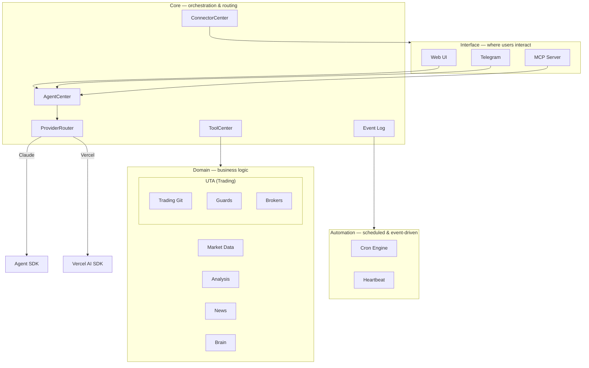

<p align="center">
  
</p>

<p align="center">
  <a href="https://github.com/TraderAlice/OpenAlice/actions/workflows/ci.yml"></a> · <a href="LICENSE"></a> · <a href="https://openalice.ai"></a> · <a href="https://openalice.ai/docs"></a> · <a href="https://deepwiki.com/TraderAlice/OpenAlice"></a>
</p>

# OpenAlice

Your one-person Wall Street. Alice is an AI trading agent that covers equities, crypto, commodities, forex, and macro — from research and analysis through position entry, ongoing management, to exit. 

- **Full-spectrum** — analyze and trade across asset classes. Multiple brokers combine into one unified workspace so you're never stuck with "I can see it but can't trade it."
- **Full-lifecycle** — not just entry signals. Research, position sizing, ongoing monitoring, risk management, and exit decisions — Alice covers the entire trading lifecycle, 24/7.
- **Full-control** — every trade goes through version history and safety checks, and requires your explicit approval before execution. You see every step, you can stop every step.

Alice runs on your own machine, because trading involves private keys and real money — that trust can't be outsourced.

<p align="center">
  
</p>

> [!CAUTION]
> **OpenAlice is experimental software in active development.** Many features and interfaces are incomplete and subject to breaking changes. Do not use this software for live trading with real funds unless you fully understand and accept the risks involved. The authors provide no guarantees of correctness, reliability, or profitability, and accept no liability for financial losses.

## Features

### Trading

- **Unified Trading Account (UTA)** — multiple brokers (CCXT, Alpaca, Interactive Brokers) combine into unified workspaces. AI interacts with UTAs, never with brokers directly
- **Trading-as-Git** — stage orders, commit with a message, push to execute. Full history reviewable with commit hashes
- **Guard pipeline** — pre-execution safety checks (max position size, cooldown, symbol whitelist) per account
- **Account snapshots** — periodic and event-driven state capture with equity curve visualization

### Research & Analysis

- **Market data** — equity, crypto, commodity, currency, and macro data via TypeScript-native OpenBB engine. Unified cross-asset symbol search and technical indicator calculator
- **Fundamental research** — company profiles, financial statements, ratios, analyst estimates, earnings calendar, insider trading, and market movers. Currently deepest for equities, expanding to other asset classes
- **News** — background RSS collection with archive search

### Automation

An append-only event log sits at the center of Alice. All system activity — trades, messages, scheduled fires, heartbeat results — flows through as typed events with real-time subscriptions. Automation features are listeners on this bus:

- **Cron scheduling** — cron expressions, intervals, or one-shot timestamps. On fire, emits an event → listener routes through AI → delivers reply to your last-used channel
- **Heartbeat** — a special cron job that periodically reviews market conditions, filters by active hours, and only reaches out when something matters
- **Webhooks** — inbound event triggers from external systems (planned)

### Interface

- **Web UI** — chat with SSE streaming, sub-channels, portfolio dashboard with equity curve, and full config management
- **Telegram** — mobile access with trading panel
- **MCP server** — tool exposure for external agents

### And More!

- **Multi-provider AI** — Claude (Agent SDK with OAuth or API key) or Vercel AI SDK (Anthropic, OpenAI, Google), switchable at runtime
- **Brain** — persistent memory and emotion tracking across conversations
- **Evolution mode** — permission escalation that gives Alice full project access including Bash, enabling self-modification


## Architecture

Alice has four layers. Each layer only talks to the one directly above or below it.



**Interface** — external surfaces (Web UI, Telegram, MCP). Users and external agents connect here. ConnectorCenter tracks last-used channel for delivery routing.

**Core** — AgentCenter routes all AI calls through ProviderRouter. ToolCenter is a shared registry — domain modules register tools there, and it exports them to whichever AI provider is active. EventLog is the central event bus.

**Domain** — business logic. UTA is the trading workspace (see Key Concepts below). Market Data, Analysis, News, and Brain are independent modules, each exposed to AI through tool registrations.

**Automation** — listeners on the EventLog bus. Cron fires scheduled jobs, Heartbeat is a special cron job for periodic market review.

## Key Concepts

**UTA (Unified Trading Account)** — The core abstraction. Each UTA wraps a broker connection, operation history, guard pipeline, and snapshot scheduler into a single self-contained workspace. AI and the frontend interact with UTAs exclusively — brokers are internal implementation details. Multiple UTAs work like independent repositories: one for Alpaca US equities, one for Bybit crypto, each with its own history and guards.

**Trading-as-Git** — The workflow inside each UTA. Stage orders, commit with a message, then push to execute. Push runs guards, dispatches to the broker, snapshots account state, and records a commit with an 8-char hash. Full history is reviewable like `git log` / `git show`.

**Guard** — A pre-execution safety check that runs inside a UTA before orders reach the broker. Guards enforce limits (max position size, cooldown between trades, symbol whitelist) and are configured per-account. Think of it as ESLint for trading — automated rules that catch problems before they go live.

**Heartbeat** — A periodic check-in where Alice reviews market conditions and decides whether to send you a message. Useful for monitoring positions overnight or tracking macro events — Alice reaches out when something matters, stays quiet when it doesn't.

**Connector** — An external interface through which users interact with Alice. Built-in: Web UI, Telegram, MCP Ask. Delivery always goes to the channel you last spoke through.

**AI Provider** — The AI backend that powers Alice. Claude (via Agent SDK, supports OAuth login or API key) or Vercel AI SDK (Anthropic, OpenAI, Google). Switchable at runtime — no restart needed.

## Quick Start

Prerequisites: Node.js 22+, pnpm 10+, [Claude Code CLI](https://docs.anthropic.com/en/docs/claude-code) installed and authenticated.

```bash
git clone https://github.com/TraderAlice/OpenAlice.git
cd OpenAlice
pnpm install && pnpm build
pnpm dev
```

Open [localhost:3002](http://localhost:3002) and start chatting. No API keys or config needed — the default setup uses your local Claude Code login (Claude Pro/Max subscription).

## Configuration

All config lives in `data/config/` as JSON files with Zod validation. Missing files fall back to sensible defaults. You can edit these files directly or use the Web UI.

**AI Provider** — The default provider is Claude (Agent SDK), which uses your local Claude Code login — no API key needed. To use the [Vercel AI SDK](https://sdk.vercel.ai/docs) instead (Anthropic, OpenAI, Google, etc.), switch `ai-provider.json` to `vercel-ai-sdk` and add your API key. Both can be switched at runtime via the Web UI.

**Trading** — Unified Trading Account (UTA) architecture. Each account in `accounts.json` becomes a UTA with its own broker connection, git history, and guard config. Broker-specific settings live in the `brokerConfig` field — each broker type declares its own schema and validates it internally.

| File | Purpose |
|------|---------|
| `engine.json` | Trading pairs, tick interval, timeframe |
| `agent.json` | Max agent steps, evolution mode toggle, Claude Code tool permissions |
| `ai-provider.json` | Active AI provider (`agent-sdk` or `vercel-ai-sdk`), login method, switchable at runtime |
| `accounts.json` | Trading accounts with `type`, `enabled`, `guards`, and `brokerConfig` (broker-specific settings) |
| `connectors.json` | Web/MCP server ports, MCP Ask enable |
| `telegram.json` | Telegram bot credentials + enable |
| `web-subchannels.json` | Web UI sub-channel definitions with per-channel AI provider overrides |
| `tools.json` | Tool enable/disable configuration |
| `market-data.json` | Data backend (`typebb-sdk` / `openbb-api`), per-asset-class providers, provider API keys, embedded HTTP server config |
| `news.json` | RSS feeds, fetch interval, retention period |
| `snapshot.json` | Account snapshot interval and retention |
| `compaction.json` | Context window limits, auto-compaction thresholds |
| `heartbeat.json` | Heartbeat enable/disable, interval, active hours |

Persona and heartbeat prompts use a **default + user override** pattern:

| Default (git-tracked) | User override (gitignored) |
|------------------------|---------------------------|
| `default/persona.default.md` | `data/brain/persona.md` |
| `default/heartbeat.default.md` | `data/brain/heartbeat.md` |

On first run, defaults are auto-copied to the user override path. Edit the user files to customize without touching version control.

## Project Structure

OpenAlice is a pnpm monorepo with Turborepo build orchestration. See [docs/project-structure.md](docs/project-structure.md) for the full file tree.

## Roadmap to v1

OpenAlice is in pre-release. All planned v1 milestones are now complete — remaining work is testing and stabilization.

- [x] **Tool confirmation** — achieved through Trading-as-Git's push approval mechanism. Order execution requires explicit user approval at the push step, similar to merging a PR
- [x] **Trading-as-Git stable interface** — the core workflow (stage → commit → push → approval) is stable and running in production
- [x] **IBKR broker** — Interactive Brokers integration via TWS/Gateway. `IbkrBroker` bridges the callback-based `@traderalice/ibkr` SDK to the Promise-based `IBroker` interface via `RequestBridge`. Supports all IBroker methods including conId-based contract resolution
- [x] **Account snapshot & analytics** — periodic and event-driven snapshots with equity curve visualization, configurable intervals, and carry-forward for data gaps

## Star History

[](https://star-history.com/#TraderAlice/OpenAlice&Date)